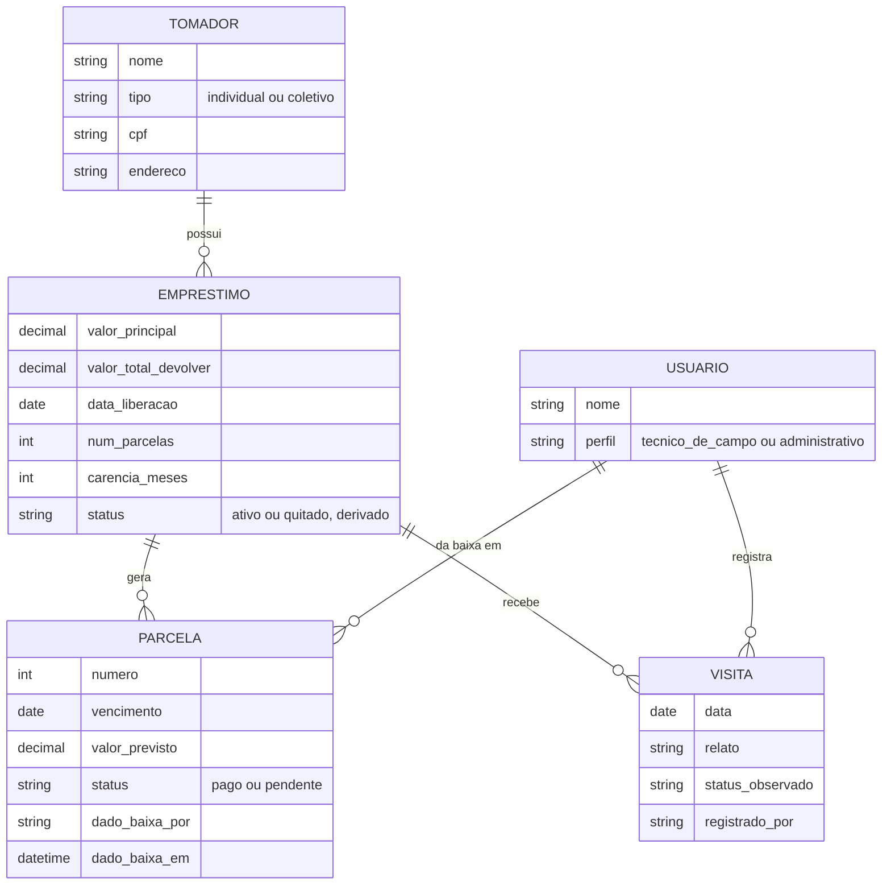

# Especificação de Requisitos e Arquitetura — Sistema FRSBJ (MVP)
 
**Cliente:** Cáritas Diocesana de Almenara
**Sistema:** Acompanhamento de campo e controle de inadimplência do Fundo Rotativo Solidário do Baixo Jequitinhonha (FRSBJ)
**Fonte primária de requisitos:** entrevista com Luana Leal (técnica de campo, Cáritas)
 
---
 
## 1. Contexto e Objetivo
 
O FRSBJ concede empréstimos solidários — individuais ou coletivos — para projetos de geração de renda ligados à Economia Popular Solidária, com devolução em parcelas acrescidas de uma contribuição solidária sobre o valor total. A gestão e aprovação dos projetos é feita pela Comissão Gestora do Fundo Rotativo, junto à Cáritas Diocesana de Almenara.
 
Hoje, o acompanhamento de campo e o controle de inadimplência são feitos por caderno e planilha. Este sistema tem como objetivo substituir esse registro manual por um cadastro estruturado, **sem assumir a complexidade do fluxo de aprovação de projetos** pela Comissão Gestora — os empréstimos entram no sistema já com o recurso liberado.
 
---

## 3. Atores (Linguagem Ubíqua)
 
### Técnico de Campo (`field_agent`)
 
Pessoa que realiza visitas presenciais aos tomadores apoiados pelo fundo. O termo reaproveita o vocabulário que os próprios documentos do FRSBJ já usam ("visita técnica", "acompanhamento técnico") e corresponde ao título real de quem exerce essa função na Cáritas hoje — não exige tradução entre a linguagem do negócio e a do sistema.
 
**Pode:**
- Registrar visita
- Dar baixa em parcela
- Consultar painel de inadimplência
- Consultar cadastro de tomador/empréstimo

### Administrativo (`back_office`)
 
Pessoa responsável pela gestão administrativa do fundo no dia a dia do sistema: cadastro, conferência de pagamentos e relatórios.
 
**Pode:**
- Dar baixa em parcela
- Consultar painel de inadimplência
- Gerar relatório de visitas em PDF
- Consultar cadastro de tomador/empréstimo
---
 
## 4. Requisitos Funcionais
 
#### RF01 — Importar dados iniciais
- **Ator:** Administrativo
- **Descrição:** Carregar, em conjunto com o Dev pela api, os tomadores e empréstimos já em andamento, criando os registros correspondentes no sistema.
- **Pré-condições:** Dados da planilha compatíveis com os campos mínimos de Tomador e Empréstimo.
- **Fluxo principal:**
  1. Administrativo fornece os dados de origem.
  2. O dev realiza o insert de cada um por meio de um endpoint
  2. Sistema valida os dados (campos obrigatórios, duplicidade de tomador).
  3. Sistema cria os registros de Tomador, Empréstimo e Parcela correspondentes.
- **Pós-condições:** Tomadores, empréstimos e parcelas existentes na planilha passam a existir no sistema.
- **Regra de negócio:** Todo empréstimo importado é considerado com recurso já liberado — não há estado intermediário de aprovação.
#### RF02 — Cadastrar tomador
- **Ator:** Administrativo
- **Descrição:** Registrar um novo tomador (individual ou coletivo) além dos importados inicialmente.
- **Fluxo principal:**
  1. Administrativo informa dados de identificação (nome/razão do grupo, tipo, integrantes, endereço de execução).
  2. Sistema salva o cadastro.
- **Pós-condições:** Tomador disponível para vincular a um empréstimo.
#### RF03 — Cadastrar empréstimo
- **Ator:** Administrativo
- **Descrição:** Registrar um novo empréstimo vinculado a um tomador existente.
- **Fluxo principal:**
  1. Administrativo seleciona o tomador.
  2. Informa valor principal, número de parcelas, datas de vencimento e carência.
  3. Sistema calcula o valor total a devolver (principal × 1,05) e gera as parcelas.
- **Pós-condições:** Empréstimo ativo, com parcelas geradas e visível para o Técnico de Campo.
- **Regra de negócio:** O acréscimo de 5% incide sobre o valor total, distribuído nas parcelas — não é juro mensal.
#### RF04 — Registrar visita de campo
- **Ator:** Técnico de Campo
- **Descrição:** Documentar uma visita realizada a um empréstimo ativo.
- **Pré-condições:** Empréstimo com status ativo (não quitado).
- **Fluxo principal:**
  1. Técnico de Campo seleciona o empréstimo a visitar.
  2. Preenche data, relato e status observado.
  3. Sistema salva o registro no histórico do empréstimo.
- **Pós-condições:** Nova visita aparece no histórico do empréstimo.
- **Regra de negócio:** Empréstimos quitados não aparecem na lista de "próxima visita", mas seu histórico de visitas anteriores permanece consultável.
#### RF05 — Dar baixa em parcela
- **Ator:** Técnico de Campo, Administrativo
- **Descrição:** Marcar uma parcela como paga.
- **Pré-condições:** Parcela com status pendente.
- **Fluxo principal:**
  1. Usuário seleciona a parcela.
  2. Confirma o pagamento.
  3. Sistema registra status = pago, além de usuário responsável e data/hora da baixa.
- **Pós-condições:** Parcela passa a pago; se todas as parcelas do empréstimo estiverem pagas, o empréstimo é considerado quitado.
- **Regra de negócio:** Como dois perfis compartilham esta ação, o sistema deve sempre registrar quem deu a baixa e quando, para fins de auditoria simples.
#### RF06 — Consultar painel de inadimplência
- **Ator:** Técnico de Campo, Administrativo
- **Descrição:** Visão consolidada dos empréstimos com parcelas em atraso, para apoiar priorização de visitas e cobrança.
- **Fluxo principal:**
  1. Usuário abre o painel.
  2. Sistema lista empréstimos com 2 ou mais parcelas em atraso, conforme o regimento.
- **Regra de negócio:** Atraso é calculado (parcela pendente com vencimento anterior à data atual), nunca armazenado como campo próprio.
#### RF07 — Consultar cadastro
- **Ator:** Técnico de Campo (leitura), Administrativo (leitura e escrita)
- **Descrição:** Consultar dados de tomador, empréstimo e parcelas, para contexto durante visita ou gestão administrativa.
- **Regra de negócio:** CPF só é exibido para o perfil Administrativo (ver RF09).
#### RF08 — Gerar relatório de visitas (PDF)
- **Ator:** Administrativo
- **Descrição:** Gerar um documento PDF com as visitas registradas em um período.
- **Fluxo principal:**
  1. Administrativo define o filtro (período e, opcionalmente, tomador/empréstimo).
  2. Sistema compila as visitas correspondentes.
  3. Sistema gera o PDF para download.
- **Suposição a confirmar:** Nesta primeira versão, apenas o Administrativo acessa este relatório — o Técnico de Campo não o visualiza. Confirmar se isso é intencional.
#### RF09 — Controle de acesso por perfil
- **Ator:** sistema
- **Descrição:** Autenticar usuários e restringir funcionalidades conforme o perfil (Técnico de Campo ou Administrativo).
- **Regra de negócio:** CPF do tomador visível apenas para o perfil Administrativo; oculto para o Técnico de Campo.
---
 
## 5. Requisitos Não Funcionais
 
- **RNF01 — Usabilidade em campo:** registrar visita e dar baixa em parcela devem ser executáveis em poucos toques, em tela de celular, mesmo por usuário sem afinidade técnica.
- **RNF02 — Auditabilidade:** toda baixa de parcela deve registrar usuário responsável e timestamp, já que os dois perfis compartilham essa ação.
- **RNF03 — Privacidade de dados pessoais:** CPF visível apenas ao perfil Administrativo.
- **RNF04 — Controle de acesso:** autenticação obrigatória; funcionalidades restritas por perfil.
- **RNF05 — Confiabilidade dos dados derivados:** nenhum dado calculável (atraso de parcela, quitação de empréstimo) deve ser armazenado de forma redundante — sempre computado a partir da fonte.
- **RNF06 — Consistência na importação inicial:** o processo de importação em lote deve validar dados antes de gravar, evitando duplicidade de tomador ou empréstimo.
- **RNF07 — Conectividade em campo (EM ABERTO):** ainda não confirmado se o uso em campo exige funcionamento offline. Locais de trabalho (roça, sede de associação, igreja, escola) costumam não ter internet, mas a decisão formal depende de validação direta com a Luana — não deve ser assumida como fechada.
- **RNF08 — Uso concorrente:** o sistema deve suportar Técnico de Campo e Administrativo operando ao mesmo tempo sem conflito de dados (ex.: dois usuários tentando dar baixa na mesma parcela).
---
 
## 6. Modelo de Domínio / Arquitetura Conceitual
 
> Esta seção descreve entidades e relacionamentos em nível conceitual. Escolhas de tecnologia (banco de dados, framework, hospedagem) ficam fora deste documento.
 
### 6.1 Entidades e relacionamentos
 

> `perfil` é armazenado no banco como `role`, com os valores `field_agent` (Técnico de Campo) e `back_office` (Administrativo).
 
Pontos que não aparecem como campos, de propósito:
- **Atraso de parcela** não é um campo — é `status = pendente E vencimento < hoje`.
- **Quitação do empréstimo** não é um campo — é "todas as parcelas com status = pago".
### 6.2 Matriz de permissões
 
| Ação | Técnico de Campo | Administrativo |
|---|---|---|
| Registrar visita | ✅ | ❌ |
| Dar baixa em parcela | ✅ | ✅ |
| Consultar painel de inadimplência | ✅ | ✅ |
| Consultar cadastro (leitura) | ✅ (sem CPF) | ✅ (com CPF) |
| Cadastrar tomador / empréstimo | ❌ | ✅ |
| Gerar relatório de visitas (PDF) | ❓ *(a confirmar — ver RF08)* | ✅ |
 
### 6.3 Princípios de design adotados
 
- **Dado derivável não é armazenado.** Atraso de parcela e quitação de empréstimo são sempre calculados a partir da fonte, nunca campos que alguém precisa lembrar de atualizar.
- **Identidade separada dos termos financeiros.** Tomador existe independente de Empréstimo, o que permite à Fase 1 (fluxo de aprovação) introduzir a entidade `Projeto` entre os dois sem precisar migrar dados existentes.
- **Visita ligada ao ciclo financeiro, não ao vínculo social.** Visita pertence ao Empréstimo, e deixa de ser sugerida como alvo quando o empréstimo é quitado — decisão consciente de escopo, não limitação técnica.
